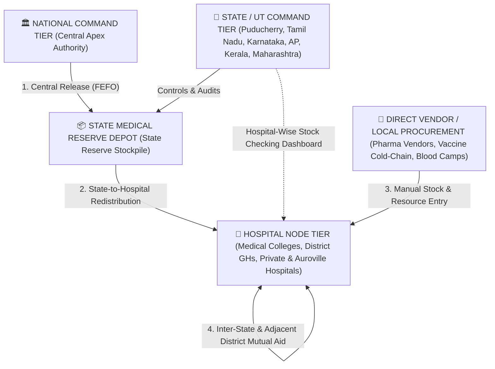

# BHISSM — Bharat Health Initiative for SupplyChain Sourcing and Management

**BHISSM** is a federated **National, State/UT, and Hospital-level Healthcare Supply-Chain Intelligence, Strategic Stockpile Distribution, and Disaster Mutual-Aid Command Platform**. It combines First-Expired First-Out (**FEFO**) batch rotation, AI demand & safety-stock forecasting, a **2-tier Central $\rightarrow$ State Reserve $\rightarrow$ Hospital distribution pipeline**, **inter-state adjacent-district mutual aid**, and **direct vendor/manual resource onboarding** in a warm command-center interface.

---

## 🏗️ Project Directory & Technical Architecture

```text
BHISSM/
├── package.json                        # Root workspace scripts (concurrently runs backend & frontend)
├── README.md                           # Architecture, Working Logic & Credentials Documentation
│
├── backend/                            # Node.js + Express + TypeScript + Prisma ORM (SQLite)
│   ├── prisma/
│   │   ├── schema.prisma               # 15+ Relational Models (State, Facility, Medicine, Inventory, etc.)
│   │   └── dev.db                      # Local SQLite database with seeded multi-state healthcare data
│   └── src/
│       ├── index.ts                    # Express server entry point (Port 3001) & route registration
│       ├── middleware/
│       │   └── auth.ts                 # JWT authentication & Role-Based Access Control (RBAC)
│       ├── routes/
│       │   ├── auth.ts                 # Login, JWT issuance, Demo auto-seeding (33+ drugs, 15+ hospitals)
│       │   ├── dashboard.ts            # Role-specific KPIs (Hospital, State Command, National Overview)
│       │   ├── nationalReserve.ts      # Central Release -> State Reserve Depot -> Hospital Redistribution
│       │   ├── inventory.ts            # FEFO Batches, State Hospital-Wise Stock Check, Direct Vendor Purchase
│       │   ├── emergency.ts            # SOS Incidents, Primary/Secondary/Supporting Hospitals, Mutual Aid
│       │   ├── bloodBank.ts            # Regional Blood Cold-Chain, Requisitions & Manual Blood Stock Entry
│       │   ├── facilities.ts           # Beds, Manual Ambulance Fleet Registration & Doctor/Staff Onboarding
│       │   ├── forecast.ts             # AI Consumption Forecasting, Safety Thresholds & Rebalancing
│       │   ├── medicines.ts            # Master Drug & Vaccine Formulary (33+ Critical Formulations)
│       │   └── alerts.ts               # Real-Time Alerts & Immutable Compliance Audit Ledger
│       └── seed/
│           └── seed.ts                 # Comprehensive multi-state database seeding script
│
└── frontend/                           # React 18 + TypeScript + Vite + Tailwind CSS + Lucide Icons
    └── src/
        ├── App.tsx                     # Application router & protected route definitions
        ├── contexts/
        │   └── AuthContext.tsx         # Global session state & role context (national | state | hospital)
        ├── components/
        │   ├── Layout.tsx              # Application shell layout
        │   ├── Header.tsx              # Branded BHISSM command header, live SOS indicator & user badge
        │   └── Sidebar.tsx             # Role-adaptive command navigation & active jurisdiction card
        └── pages/
            ├── LoginPage.tsx           # State-grouped Quick Login & credential selector
            ├── DashboardPage.tsx       # Role-specific Command Dashboard (Hospital / State / National)
            ├── NationalReservePage.tsx # 2-Tier Pipeline: Central Stockpile & State Reserve Redistribution
            ├── InventoryPage.tsx       # State Hospital-Wise Stock Matrix, FEFO Batches & Direct Vendor Entry
            ├── EmergencyPage.tsx       # Disaster Ops, Designated Hospital Hierarchy & Mutual Aid Corridor
            ├── BloodBankPage.tsx       # Blood Availability Matrix, Requisitions & Manual Blood Entry
            ├── CapacityPage.tsx        # Live Bed Census, Manual Ambulance Registration & Doctor Onboarding
            ├── ForecastPage.tsx        # AI Demand Surge Prediction & Multi-Facility Rebalancing
            └── AuditAlertsPage.tsx     # Stockout/Expiry Alerts & Immutable Audit Trail
```

---

## ⚙️ Detailed Working Logic of the Project

### 1. Three-Tier Federated Role Hierarchy
BHISSM operates across three distinct authority levels enforced by JWT middleware (`authenticateToken` & `requireRole`):



---

### 2. Two-Tier Strategic Medicine Distribution Pipeline (`Central` $\rightarrow$ `State Reserve` $\rightarrow$ `Hospital`)
Instead of bypassing state health authorities, central stockpile releases follow a strict two-stage governance workflow:

1. **Stage 1 — Central Release to State Reserve Stock (`POST /api/national-reserve/release`)**:
   * **National Command** monitors the **Central Strategic Stockpile** (which enforces a protected **30% Statutory Minimum Reserve** and exposes a **70% Releasable Disaster Quota**).
   * When National Command authorizes a release to a state (e.g., *Puducherry* or *Tamil Nadu*), BHISSM automatically locates or provisions that state's **`State Medical Reserve Depot`** (`type: 'state_reserve'`) and credits the released quantity into the state's reserve `Inventory` and `InventoryBatch` with an immutable `national_release_inward` transaction.
2. **Stage 2 — State Reserve Inspection & Hospital Redistribution (`GET /api/national-reserve/state-stock` & `POST /api/national-reserve/state-redistribute`)**:
   * **State Command** logs in and opens **State Reserve & Redistribution** (or **Hospital-Wise Stock Check**).
   * The State Controller inspects all medicines sitting in their **State Reserve Stockpile** and redistributes specific quantities to any **Hospital under their state jurisdiction** (e.g., *JIPMER*, *IGGGHRI Puducherry*, *PIMS Kalapet*, *Rajiv Gandhi Women & Children Hospital*, *East Coast Hospitals*, *Auroville Health Centre*).
   * The backend deducts the stock from the State Reserve Depot using **FEFO** (First-Expired First-Out) and credits the recipient hospital's `Inventory` and `InventoryBatch` with a `state_reserve_redistribution` audit log.

---

### 3. Hospital-Wise Medicine & Vaccine Stock Checking Dashboard (State Login)
* Accessible to **State Controllers** via **[`InventoryPage.tsx`](file:///D:/Programming/BHISSM/frontend/src/pages/InventoryPage.tsx)** (`GET /api/inventory/state-hospital-summary`):
  * Displays an interactive **Hospital-Wise Medicine & Vaccine Stock Checking Matrix** listing every hospital in the state's jurisdiction.
  * Each hospital card displays:
    * **Total Medicines**, **Total Vaccines**, and **Total Usable Stock Units**
    * **Low-Stock Risk Count** and **Stockout Count**
    * Top **Critical Deficit Formulations** (`current_stock / safety_threshold`)
  * Clicking any hospital card filters the master inventory table below to that hospital's exact stock rows.
  * Every row includes a **`+ Allocate`** button allowing the State Controller to immediately dispatch replenishment units from the **State Reserve Stockpile** to that specific hospital.

---

### 4. Manual Stock Entry & Direct Vendor Onboarding System (Hospitals & State)
Hospitals frequently procure supplies directly from approved pharmaceutical vendors or onboard new emergency assets locally. BHISSM provides dedicated manual entry workflows across all four resource pillars:

| Resource Pillar | Frontend Page | Backend Endpoint | Working Logic |
| :--- | :--- | :--- | :--- |
| **1. Medicines (Direct Vendor Purchase)** | `InventoryPage.tsx` (`+ Direct Vendor Purchase`) | `POST /api/inventory/vendor-purchase` | Select any drug from the 33+ master catalog **or** create a new custom formulation. Records Vendor Name, Invoice/PO #, Batch/Lot #, Expiry Date, Unit Cost, and Storage Location. Automatically updates `Inventory`, creates a FEFO `InventoryBatch`, and logs a `vendor_purchase` transaction. |
| **2. Vaccines (Cold-Chain Entry)** | `InventoryPage.tsx` (`+ Manual Vaccine Entry`) | `POST /api/inventory/vendor-purchase` | Dedicated cold-chain entry (`2°C–8°C ILR`) for vaccines (Rabies, Tetanus, Anti-Snake Venom, Hepatitis B, Typhoid, COVID-19, etc.) with lot tracking and expiry scheduling. |
| **3. Blood Units (Camp / Vendor / Donor)** | `BloodBankPage.tsx` (`+ Manual Blood Stock Entry`) | `POST /api/blood-bank/manual-entry` | Automatically provisions or updates the hospital's `BloodBank` for any Blood Group (`A+`, `A-`, `B+`, `B-`, `AB+`, `AB-`, `O+`, `O-`) and Component (`packed_rbc`, `whole_blood`, `platelets`, `plasma`), recording Collection Source, Bag Reference #, and Expiry Date. |
| **4. Ambulances, Doctors & Bed Wards** | `CapacityPage.tsx` (`+ Add New Ambulance`, `+ Add Doctor`, `+ Add Bed Ward`) | `POST /api/facilities/ambulances`, `POST /api/facilities/staff`, `POST /api/facilities/:id/capacity` | Manually registers new `ALS` / `BLS` / `Mobile ICU` ambulances (registration plate, zone, onboard life-support gear), onboards Doctors / Trauma Surgeons / Specialists with rapid deployment times, and configures ICU/Trauma/General bed wards. |

---

### 5. Emergency Command, Designated Hospital Hierarchy & Authorized Receipt Protocol
1. **Designated Hospital Roles per Emergency (`Primary`, `Secondary`, `Supporting`)**:
   * When an emergency or mass-casualty incident is declared (`POST /api/emergency/declare`), the command designates:
     * **🥇 Primary Lead Hospital**: Main trauma/triage command center for the incident.
     * **🥈 Secondary Backup Hospital**: Overflow critical care & surgical backup.
     * **🤝 Supporting Hospitals**: Additional network facilities assigned to assist.
2. **Strict Authorization for Confirming & Receiving Dispatched Aid (`POST /api/emergency/aid/:aidRequestId/confirm-receipt`)**:
   * Only the **Requesting Hospital**, the incident's designated **Primary / Secondary / Supporting Hospitals**, or the **State Controller** are authorized to click **"Confirm & Receive"** when mutual-aid shipments arrive.
   * Uninvolved third-party hospitals are blocked at both the UI and API levels (`403 Forbidden`) from intercepting or confirming receipt.
3. **Self-Fulfillment Prevention & Resource Heading Accuracy**:
   * A hospital requesting aid sees `Requisitioned by your facility (Awaiting network mutual aid)` and is never prompted to fulfill its own request.
   * Requisitions for **Ambulances**, **Doctors/Specialists**, **Blood Units**, and **Medicines** display their exact resource category icon and title (`🚑 ALS Ambulance`, `👨‍⚕️ Trauma Surgeon`, `🩸 O- Packed RBC`, `💊 Medicine`) rather than defaulting to medicine names.

---

### 6. Inter-State & Adjacent District Mutual Aid Corridor
* Healthcare emergencies near state borders (such as **Puducherry UT** enclaves bordered by **Tamil Nadu's Villupuram and Cuddalore districts**, or the **Auroville cross-border region**) require seamless inter-state coordination.
* BHISSM's `ADJACENT_STATE_CORRIDORS` engine (`backend/src/routes/emergency.ts`) automatically shares active emergency incidents and mutual-aid requisitions across adjacent states (`Puducherry` $\leftrightarrow$ `Tamil Nadu` $\leftrightarrow$ `Karnataka` $\leftrightarrow$ `Kerala` $\leftrightarrow$ `Andhra Pradesh`), allowing neighboring district hospitals (e.g., *GH Villupuram*, *GH Cuddalore*, *Santigiri Hospital Auroville*, *PIMS Kalapet*, *JIPMER*) to view and fulfill urgent aid requests across state lines.

---

### 7. National Disaster Escalation Filter (`> 500 Affected Casualties`)
* To prevent routine municipal or single-hospital incidents from cluttering the **National Command Dashboard**, BHISSM enforces a **National Disaster Escalation Threshold**:
  * **State & Hospital Dashboards**: View all local, district, and inter-state corridor emergencies regardless of size.
  * **National Dashboard (`national`)**: Displays only **National-Level Catastrophic Disasters** where **`estimatedAffected > 500`** (e.g., *Super Cyclone Fengal Coastal Surge — 1,450 casualties*), alongside the nationwide Medicine Distribution Network Overview.

---

### 8. FEFO Batch Rotation & Dynamic Safety Stock Protection
* **FEFO (First-Expired First-Out)**: Every consumption, emergency aid dispatch, or State Reserve redistribution automatically deducts from the earliest-expiring non-expired `InventoryBatch` first.
* **Dynamic Safety Buffer**: Donor hospitals offering mutual aid are protected by a calculated safety threshold (`usable_stock - safety_threshold`), ensuring a donor hospital never depletes its own critical buffer while helping another facility.

---

## 🔑 Multi-State, National & Hospital Access Credentials

You can click any credential card on the login screen (`http://localhost:5173/login`) to **Auto-fill** or click **"Quick Login →"** for immediate one-click entry.

### 1. National Command
| User Role | Username | Password | Jurisdiction / Scope |
| :--- | :--- | :--- | :--- |
| **National Stockpile Monitor** | `national_monitor_01` | `BHISSM@National#01` | Central Apex Authority (Releases to State Reserve & Nationwide View) |
| **National Logistics Director** | `national_director_01` | `BHISSM@National#Dir01` | Central Disaster Health Coordinator (>500 Casualty Disasters) |

### 2. State & UT Controllers
| State / UT | Username | Password | Authority & Capabilities |
| :--- | :--- | :--- | :--- |
| **Puducherry UT** | `state_puducherry_admin` | `BHISSM@State#P01` | Puducherry UT Health Dept (State Reserve & Hospital-Wise Stock Check) |
| **Tamil Nadu** | `state_tamilnadu_admin` | `BHISSM@State#TN01` | Tamil Nadu State Health Command, Chennai |
| **Karnataka** | `state_karnataka_admin` | `BHISSM@State#KA01` | Karnataka Health & Family Welfare, Bengaluru |
| **Andhra Pradesh** | `state_andhra_admin` | `BHISSM@State#AP01` | Andhra Pradesh State Health Authority, Vijayawada |
| **Kerala** | `state_kerala_admin` | `BHISSM@State#KL01` | Kerala Health Services Directorate, Thiruvananthapuram |
| **Maharashtra** | `state_maharashtra_admin` | `BHISSM@State#MH01` | Public Health Department, Mumbai |

### 3. Hospital Nodes (Public, Apex, Private & Auroville Area)
| State / UT | Hospital Facility | Username | Password |
| :--- | :--- | :--- | :--- |
| **Puducherry** | JIPMER Central Medical Institute | `hospital_jipmer_01` | `BHISSM@Demo#J01` |
| **Puducherry** | Indira Gandhi Govt General Hospital (GH Puducherry) | `hospital_puducherry_01` | `BHISSM@Demo#P01` |
| **Puducherry** | PIMS (Pondicherry Institute of Medical Sciences, Kalapet) | `hospital_pims_01` | `BHISSM@Demo#PIMS01` |
| **Puducherry** | Rajiv Gandhi Govt Women & Children Hospital, Puducherry | `hospital_rggwch_01` | `BHISSM@Demo#RGW01` |
| **Puducherry** | East Coast Hospitals, Puducherry (Private Multi-Specialty) | `hospital_eastcoast_01` | `BHISSM@Demo#ECH01` |
| **Puducherry** | Auroville Health Centre (Aspiration, Auroville Area) | `hospital_auroville_01` | `BHISSM@Demo#AV01` |
| **Tamil Nadu** | Santigiri & Quiet Healing Hospital (Auroville Area) | `hospital_santigiri_01` | `BHISSM@Demo#AV02` |
| **Tamil Nadu** | GH Villupuram Medical College Hospital (Adjacent to PY) | `hospital_villupuram_01` | `BHISSM@Demo#V01` |
| **Tamil Nadu** | GH Cuddalore General Hospital (Adjacent to PY) | `hospital_cuddalore_01` | `BHISSM@Demo#C01` |
| **Tamil Nadu** | Stanley Medical College & Hospital, Chennai | `hospital_stanley_01` | `BHISSM@Demo#TN01` |
| **Tamil Nadu** | Rajiv Gandhi Govt General Hospital, Chennai | `hospital_rajivgandhi_01` | `BHISSM@Demo#TN02` |
| **Karnataka** | Victoria Hospital (BMCRI), Bengaluru | `hospital_victoria_01` | `BHISSM@Demo#KA01` |
| **Karnataka** | Bowring & Lady Curzon Hospital, Bengaluru | `hospital_bowring_01` | `BHISSM@Demo#KA02` |
| **Andhra Pradesh**| King George Hospital (KGH), Visakhapatnam | `hospital_kgh_01` | `BHISSM@Demo#AP01` |
| **Kerala** | Government Medical College, Thiruvananthapuram | `hospital_gmct_01` | `BHISSM@Demo#KL01` |
| **Maharashtra** | KEM Hospital, Mumbai | `hospital_kem_01` | `BHISSM@Demo#MH01` |

---

## 🚀 How to Run (From Terminal)

```powershell
# 1. Start both Backend & Frontend concurrently from the root folder:
cd D:\Programming\BHISSM
npm run dev

# 2. Or start them in separate terminals:
# Terminal 1 — Backend API (runs at http://localhost:3001):
cd D:\Programming\BHISSM\backend
npm run dev

# Terminal 2 — Frontend UI (runs at http://localhost:5173):
cd D:\Programming\BHISSM\frontend
npm run dev
```
BHISMM founder and presented by Anish Sinha,
Member Mayank Mani Pandey.
